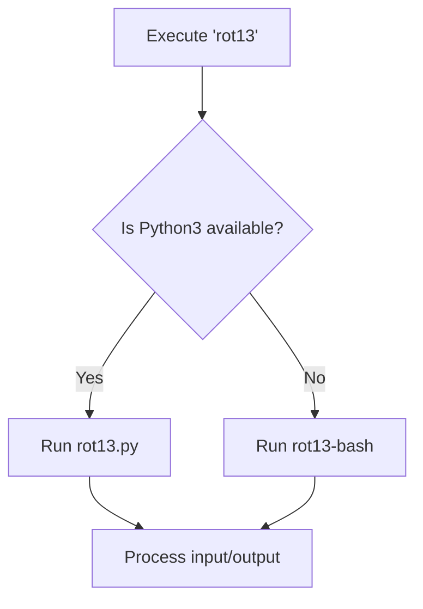

# ROT13 — Command-Line ROT13 Utility

## Overview

A UNIX-style `rot13` command that performs ROT13 encoding/decoding. The tool behaves like a native terminal utility and is available system-wide.

**Input types supported:**

- Command-line strings
- One or more files
- Standard input (via pipes or redirection)

ROT13 is symmetrical - the same command encodes and decodes.

## Architecture

Three files work together:

| File | Language | Purpose |
| --- | --- | --- |
| **`rot13`** | Bash | Dispatcher that selects the best available implementation |
| **`rot13.py`** | Python 3 | Primary implementation with full features |
| **`rot13-bash`** | Bash + `tr` | Fallback implementation with no external dependencies |

### Implementation Details

**`rot13.py` (Primary):**

- Full-featured (stdin, files, strings, mixed input)
- Supports `o / --output` option
- Displays help page when invoked with no arguments
- Written for clarity and extensibility

**`rot13-bash` (Fallback):**

- Pure Bash with `tr` command
- No external dependencies
- Used automatically when Python is unavailable

## Execution Flow



## Installation

1. Place all three files in `/usr/local/bin/`:

```bash
sudo cp rot13 rot13.py rot13-bash /usr/local/bin/
```

1. Make them executable:

```bash
sudo chmod +x /usr/local/bin/rot13*
```

Since `/usr/local/bin` is typically in `$PATH`, the command becomes available from any directory.

## Usage Examples

### Basic Encoding/Decoding

```bash
rot13 "hello world"
```

### File Processing

```bash
rot13 file.txt
rot13 file1.txt file2.txt
```

### Input Redirection

```bash
echo "secret message" | rot13
rot13 < input.txt
cat file.txt | rot13 | grep "pattern"
```

### Output to File

```bash
rot13 input.txt -o encoded.txt
rot13 "text" -o output.txt
```

### Help and Information

```bash
rot13            # Shows help page
rot13 --version  # Version information
```

## Design Philosophy

- **Python first**: For clarity, extensibility, and robust input handling
- **Bash fallback**: Ensures functionality in minimal environments
- **Dispatcher pattern**: Avoids duplicate command names and PATH conflicts
- **UNIX conventions**: Follows standard utility behavior patterns

## Notes

- No separate man page - help is built into the utility
- Version information available via `-version` flag
- Gracefully handles mixed input sources
- Compatible with recovery environments and minimal shells

---

*This setup transforms a simple ROT13 script into a robust, system-wide command-line tool with proper UNIX ergonomics.*
